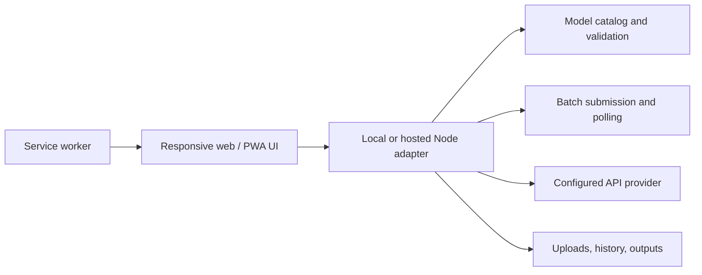

# Local AI Media Studio

> Build more, spend less, switch faster.

An independent open-source generation workspace. Choose a task, compare compatible models, upload media, run batches, and manage results from one responsive interface.

> **Independent project:** This repository is maintained by its open-source contributors. It is not an official product of, published by, sponsored by, or affiliated with DreamAPI, DreamFace, or NewportAI. Users connect their own API credentials to compatible provider endpoints.

Local AI Media Studio serves two audiences from the same codebase:

- **Simple mode** guides creators through one task and one model at a time.
- **Pro mode** adds multi-model comparison, repeated runs, batch files, cost estimates, and concurrent task submission.

It supports two delivery modes:

| Platform | Recommended delivery | Where files are stored |
| --- | --- | --- |
| Windows | Download the release ZIP and double-click `start.bat` | `data/uploads`, `data/outputs`, and `data/tasks.json` on the PC |
| iPhone / iPad | Open a hosted HTTPS deployment in Safari and add it to the Home Screen | Download results to Photos or Files; the hosted service retains task metadata according to its deployment policy |
| macOS | Download the release ZIP and double-click `start.command` | Local project data directory |
| Developer / server | Run with Node.js or Docker | Configurable with `LOCAL_STUDIO_DATA_DIR` |

The interface can open from a cached PWA shell, but generation requires an internet connection to the configured API provider. This repository does not run AI models locally.

## Quick start for Windows

1. Download the latest ZIP from **Releases** and extract it.
2. Install [Node.js 20+](https://nodejs.org/) once if it is not already installed.
3. Double-click `start.bat`.
4. Open `http://127.0.0.1:8788/` if the browser does not open automatically.
5. Select **Connect API Key**, enter your own compatible key, and start generating.

The key stays in the local Node.js process memory and is not written to task history or browser storage.

## iPhone and iPad

iOS cannot run the included Node.js local service. Deploy the repository to an HTTPS server first, then:

1. Open the deployment URL in Safari.
2. Tap **Share**.
3. Tap **Add to Home Screen**.
4. Open Local Studio from the new Home Screen icon.
5. Connect an API key for the current session.

Use hosted mode only on infrastructure you trust because API requests pass through that service. GitHub Pages alone cannot run the API adapter in this repository. See [Hosted PWA deployment](docs/DEPLOYMENT.md).

## Features

- Video, image, audio, and avatar generation categories.
- Task-first filtering followed by compatible model selection.
- 42 mapped API capability entries in `catalog.mjs`.
- Dynamic forms for required media, prompts, dimensions, durations, ratios, seeds, and model-specific options.
- Multi-file, multi-model, and repeated-run batches with a ten-task safety limit.
- Two concurrent submissions, independent status polling, failure reporting, and local result downloads.
- Generated library with model, task, duration, resolution, ratio, size, and save status.
- Local file paths and task-history location shown inside the product.
- Responsive touch layout, installable PWA manifest, iOS safe-area handling, and offline shell caching.
- API key validation, same-origin checks, request-size limits, conservative credit limits, and server-side parameter validation.
- Hosted session isolation so one browser identity cannot list or poll another browser's tasks.
- No runtime npm dependencies.

## Provider connections

Local AI Media Studio is designed as a bring-your-own-key workspace. Each API platform has its own account, API key, billing balance, model identifiers, request schema, upload process, task status API, and result format. A key issued by one platform normally cannot be used with another platform.

| Provider | Current status | What the user needs |
| --- | --- | --- |
| Compatible API adapter | Available; provides the 42 mapped capability entries in this release | A compatible API key |
| fal.ai | Adapter planned; not callable from this release | A fal API key plus a fal adapter |
| Replicate | Adapter planned; not callable from this release | A Replicate API token plus a Replicate adapter |
| OpenAI / Stability AI / other providers | Extension path documented; not callable from this release | The provider's credential plus a provider-specific adapter and model catalog |

Adding a provider does not require rebuilding the interface. The adapter must normalize authentication, uploads, submission, polling, errors, pricing metadata, and results into the local catalog contract. Provider names are used only to describe compatibility and do not imply affiliation, sponsorship, or endorsement.

## Run locally

```bash
git clone https://github.com/JaggerSunnn/local-ai-media-studio.git
cd local-ai-media-studio
npm start
```

Open `http://127.0.0.1:8788/`.

For a free mock workflow that never submits a paid generation:

```bash
npm run dev
```

## Hosted PWA

```bash
docker build -t local-ai-media-studio .
docker run --rm -p 8788:8788 \
  -e LOCAL_STUDIO_DEPLOYMENT_MODE=hosted \
  local-ai-media-studio
```

Production hosting must provide HTTPS. For durable history and output retention, mount the `data` directory to persistent storage. Review [Deployment](docs/DEPLOYMENT.md) before making a public service available.

## Configuration

| Variable | Default | Purpose |
| --- | --- | --- |
| `PORT` | `8788` | Local HTTP port |
| `HOST` | `127.0.0.1` locally, `0.0.0.0` when hosted | Listening interface |
| `LOCAL_STUDIO_BASE_URL` | `https://api.newportai.com` | Compatible provider base URL |
| `LOCAL_STUDIO_DEPLOYMENT_MODE` | `local` | `local` or `hosted` behavior |
| `LOCAL_STUDIO_DATA_DIR` | repository `data` directory | History, uploads, and outputs |
| `LOCAL_STUDIO_MOCK` | `false` | Local mock generation for UI development |
| `MAX_TASK_CREDITS` | `1000` | Reject a task when a known estimate exceeds this limit |
| `LOCAL_STUDIO_API_KEY` | empty | Development-only key injection; UI entry is preferred |

## Architecture



The browser never calls provider endpoints directly. The Node adapter normalizes file upload, task submission, result polling, errors, and output downloads. Details are in [Architecture](docs/ARCHITECTURE.md).

## Model maintenance

Models are defined in `catalog.mjs`. Each entry declares its endpoint, fields, mappings, options, defaults, content profiles, pricing metadata, and output type. The UI renders the form from this catalog.

The default adapter currently targets the compatible API at `api.newportai.com`. Its entries were mapped from available contracts, but not every paid endpoint has been re-tested for this release. Run contract checks with a controlled test account before claiming full production support. See [Model catalog guide](docs/MODEL_CATALOG.md).

## Validation

```bash
npm run check
npm test
npm run package
```

The checks cover catalog integrity, PWA assets, local API-key non-persistence, batch creation, polling, local result download, and hosted task isolation.

## Privacy and content

- Do not commit API keys, uploads, outputs, or customer task history.
- Local mode binds to `127.0.0.1` by default and should not be exposed to a network.
- Hosted mode keeps UI-entered keys in server memory for the session; it does not write them to history.
- Application operators remain responsible for authentication, retention, content rules, consent, age requirements, and applicable law.
- The built-in client checks are not a substitute for server-side policy enforcement.

## Project documents

- [Architecture](docs/ARCHITECTURE.md)
- [Deployment](docs/DEPLOYMENT.md)
- [Model catalog](docs/MODEL_CATALOG.md)
- [Contributing](CONTRIBUTING.md)
- [Security policy](SECURITY.md)
- [Changelog](CHANGELOG.md)

## License

[MIT](LICENSE). Third-party provider names and marks belong to their respective owners. Their presence in compatibility metadata does not indicate sponsorship, affiliation, or endorsement.
